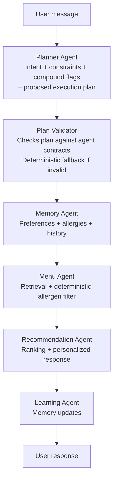
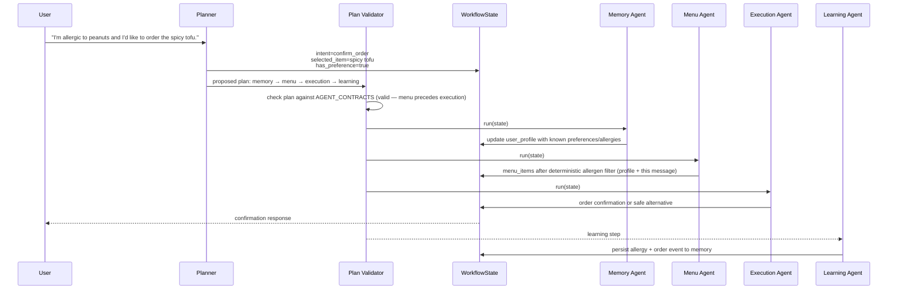

# Plateful AI Architecture

> A hybrid multi-agent catering assistant that combines LLM-driven dynamic planning with a deterministic, contract-based safety gate, for meal recommendations, ordering, meal planning, and preference learning.

---

## 1. Problem Statement

### What the system solves

Plateful AI is a workplace catering assistant for employees who want to browse menus, get meal recommendations, place orders, manage weekly meal plans, and have the system remember their preferences over time.

The core challenge is that user requests are rarely isolated. A single message can combine multiple needs:

- "I'm vegetarian. What should I order today?"
- "I'm allergic to peanuts and I'd like to order the spicy tofu."
- "Swap Tuesday for pasta and remember that I don't like tofu."
- "That looks good, confirm it."

A simple chatbot can respond to these messages, but a production-minded assistant needs to do more than generate text. It needs to understand intent, retrieve context, enforce safety rules, execute actions, maintain state, and learn from the outcome.

### Why a single LLM is not enough

A single large prompt could classify the request, reason about the menu, remember preferences, filter allergens, recommend items, and place orders. That approach is simple to prototype, but it creates several problems:

- Workflow execution becomes difficult to test.
- Safety rules depend too heavily on model behavior.
- Tool responsibilities become hard to isolate.
- Context grows as new capabilities are added.
- Failure handling becomes opaque.
- Nothing stops the model from silently skipping a safety-critical step.

Plateful AI uses a hybrid architecture instead: an LLM plans — deciding what needs to happen and in what order — but deterministic software validates every plan against declared agent contracts before it executes, and safety filtering never depends on the LLM's judgment at all.

### Design goals

The architecture was designed around five goals:

1. **Never execute an unsafe or invalid plan.** The LLM proposes the execution plan, but a deterministic Plan Validator checks it against declared agent contracts before anything runs, and replaces it with a safe fallback if it fails.
2. **Keep safety outside the LLM.** Allergen checks are enforced through deterministic filtering, not through plan validity alone — the filter itself never depends on model judgment.
3. **Make agents specialized and testable.** Each agent has a bounded responsibility and owns its own tools.
4. **Support stateful conversations.** Meal plans, menu items, and recommendations persist across turns.
5. **Degrade gracefully.** The system should still run without external LLM or memory services (see section 6).

---

## 2. High-Level Architecture

The system separates planning, plan validation, agent execution, and learning. Agents never call each other; the workflow executor runs them in order over a shared `WorkflowState`.

The primary path (a recommendation request) looks like this:



`learning` is a `post_action` agent — the Plan Validator requires it to run last in any plan that includes it, and on the live path it runs synchronously like every other step (see the note in §3.6).

The Planner builds the agent sequence itself now — there is no separate router composing it from a lookup table on the primary path. The static intent → workflow table below still exists, but its role changed: it's the **deterministic fallback** the Plan Validator falls back to when the LLM's proposed plan is missing, unparseable, or fails contract validation (and it's still the entire path when running in keyword mode, e.g. with no `ANTHROPIC_API_KEY` configured):

| Intent | Fallback workflow |
|---|---|
| `get_recommendation` | memory → menu → recommendation |
| `confirm_order` | memory → menu → execution |
| `create_mealplan` | memory → menu → mealplan |
| `submit_mealplan` | execution |
| `out_of_scope` | (empty — short-circuits with a scoped response) |
| any intent + `has_preference=true` | base workflow + learning appended |

At a high level, the request flow is:

```text
User message
  -> Planner Agent
       -> intent
       -> constraints
       -> compound flags
       -> proposed execution plan (ordered agent steps)
  -> Plan Validator
       -> checks the proposed plan against AGENT_CONTRACTS
       -> valid  -> execute as proposed
       -> invalid -> replace with the deterministic fallback plan
  -> Agent execution over shared WorkflowState
       -> memory / menu / recommendation / mealplan / execution / learning
  -> Response + traces + audit snapshots
```

The most important architectural boundary is between the **Planner Agent** and the **Plan Validator**.

The planner decides **what the user is asking for, and proposes how to execute it**.

The Plan Validator decides **whether that proposal is safe and contract-valid to actually run** — it is the only thing standing between an LLM plan and the executor, and it never trusts the plan on the model's word alone.

---

## 3. Architectural Principles

### 3.1 Hybrid AI: LLMs reason and plan, software validates and enforces safety

Plateful AI uses LLMs where natural-language reasoning is useful: understanding intent, extracting constraints, composing the execution plan itself, and generating concise personalized recommendations.

It does not use the LLM as the final, unchecked authority over workflow execution. The LLM proposes an ordered plan of agent steps; deterministic code (the Plan Validator) checks that plan against each agent's declared contract — its required inputs, what it produces, and safety-critical ordering rules — before anything executes. A plan that fails validation is never run; it's transparently replaced with a deterministic fallback plan instead.

This keeps the system flexible without making it unpredictable: the LLM has real freedom in how it composes agent sequences for new or compound requests, but that freedom is bounded by a hard, testable gate rather than trust.

### 3.2 Planner proposes; Plan Validator gates

The Planner Agent produces structured planning output, including the plan itself:

```json
{
  "intent": "confirm_order",
  "constraints": {
    "selected_item": "spicy tofu",
    "preference": "allergic to peanuts"
  },
  "compound_flags": {
    "has_preference": true
  },
  "plan": [
    {"agent": "memory", "reason": "check allergies"},
    {"agent": "menu", "reason": "filter safe items before ordering"},
    {"agent": "execution", "reason": "place the order"},
    {"agent": "learning", "reason": "remember the preference"}
  ]
}
```

The Planner does not directly call agents or tools — it only proposes. The Plan Validator (`resolve_validated_plan`) is what actually decides whether that proposal runs:

1. It checks every step's declared inputs are satisfied by an earlier step's outputs (or already available this session), using the same `AGENT_CONTRACTS` registry that describes each agent's `requires` / `requires_any` / `produces`.
2. If the plan is valid, it executes exactly as proposed.
3. If it isn't, the plan is discarded and replaced with the deterministic `compose_plan` fallback for that intent — the same mechanism used when the LLM is unavailable — so an invalid plan degrades the request rather than breaking it.

One contract rule is safety-critical rather than just structural: `execution` can never be satisfied by a user-named `selected_item` alone. It must be preceded by `menu` (or already have filtered `menu_items` / `recommendations` / an existing `meal_plan` available), because those are the only paths that guarantee the deterministic allergen filter actually ran. A plan that tries to place an order without it is rejected outright — this is enforced by contract, not by asking the LLM to remember to include the safety step.

### 3.3 Agents own their own tools

Each agent owns the tools needed to complete its responsibility. The orchestrator does not need to know the implementation details of menu lookup, memory retrieval, recommendation ranking, meal planning, or order execution.

This creates cleaner boundaries:

```text
Orchestrator
  -> runs workflow steps

Agent
  -> owns domain logic
  -> owns tool calls
  -> updates workflow state
```

The result is easier to extend. Adding a new capability usually means adding or modifying an agent (and its contract), not rewriting the orchestrator — and, unlike a static router, the planner doesn't need a new hand-written routing rule to start using it in new compositions.

### 3.4 Safety is deterministic

Safety-critical checks are not delegated to the LLM.

The Menu Agent applies deterministic allergen filtering during retrieval, before recommendations are generated. It checks the user's allergen profile from persisted memory **and** scans the current message directly — so a same-turn "I'm allergic to X, order me Y" is protected immediately, not only from the next turn onward once memory catches up. If a user has a known allergen, unsafe items are removed from the candidate set before the Recommendation Agent sees them. When the user explicitly requests an unsafe item, the conflict is recorded in `WorkflowState.allergen_conflicts` and surfaced in the response.

This is deliberately a second, independent layer from the Plan Validator: the validator guarantees the Menu Agent's filtering step is present in the plan; the Menu Agent's own logic guarantees that step actually screens against every allergen the user has mentioned, this turn included, regardless of what the planner did or didn't put in `constraints`.

> **Note on the Policy Agent.** A `PolicyAgent` exists in the codebase, but it is **not part of the active runtime path** by default. It is an extension point for future business-rule enforcement (budget thresholds, approvals, corporate policy) — reachable today only if the Planner's proposed plan includes it and the Plan Validator accepts that plan, since no static fallback route currently includes it.

### 3.5 Conversations are stateful

The WebSocket session carries forward important state across turns:

- active meal plan
- latest menu items
- latest recommendations
- selected items
- user/session identifiers

This allows natural follow-up behavior:

```text
User: Build me a meal plan for the week.
Assistant: Here is your plan...
User: Replace Tuesday with pasta.
Assistant: Updated Tuesday without regenerating the entire plan.
```

It also feeds back into planning: the Planner's prompt is told what's already available this session (e.g. a filtered menu already fetched, or an active meal plan), so it knows when a prerequisite step can legitimately be skipped — submitting an existing meal plan doesn't need to re-fetch the menu, for instance.

### 3.6 Learning is a bounded, terminal step

The Learning Agent saves preferences, restrictions, and order events to long-term memory. Its contract marks it `post_action`, so the Plan Validator requires it to be the last step in any plan that includes it — nothing runs after learning has fired.

> **Current limitation.** On the live LLM-planned path, `learning` executes synchronously like every other step — the user's response is only sent after it completes, so it does add to request latency today. A genuinely async, fire-and-forget dispatch (`asyncio.create_task`, off the response path) exists in the codebase but is only wired into an unused legacy static flow, not the live planner-driven path. Worth knowing before describing this as "async" in an interview — the current story is "terminal and ordered-last," not yet "off the critical path."

---

## 4. Request Lifecycle

This section walks through a compound request:

> "I'm allergic to peanuts and I'd like to order the spicy tofu."

The request combines two things:

1. A new safety-relevant preference: peanut allergy.
2. An order intent: the user wants spicy tofu.

### 4.1 Lifecycle diagram

Agents do not call each other. The executor runs each step of the validated plan; every agent reads from and writes to the shared `WorkflowState`.



### 4.2 Step-by-step

#### Step 1 — Planner extracts structured intent and proposes a plan

The planner reads the user message and emits structured output. It identifies the primary intent as `confirm_order`, extracts `selected_item`, sets `has_preference` because the user also stated an allergy, and proposes the ordered plan `memory → menu → execution → learning`.

#### Step 2 — Plan Validator checks the proposal

The Plan Validator checks each step's contract:

```text
memory -> menu -> execution -> learning
```

`execution` requires a filtered `menu_items` (or equivalent) to already be available — `menu` precedes it, so that's satisfied. `learning` is a post-action agent and correctly runs last. The plan is valid and executes as proposed; had it been invalid, the deterministic fallback for `confirm_order` would have run instead.

#### Step 3 — Memory retrieves known profile

The Memory Agent retrieves existing user context such as allergies, dietary restrictions, prior preferences, and order history, and writes it to `WorkflowState.user_profile`.

This context helps the downstream agents personalize behavior and apply safety filters.

#### Step 4 — Menu applies deterministic filters

The Menu Agent fetches relevant menu items and applies deterministic filtering for:

- budget
- cuisine
- food keywords
- availability
- allergens — from the persisted profile **and** any allergy declared in this same message

Allergen filtering happens here — before execution or any recommendation text. Unsafe items are removed from the candidate set, and conflicts with explicitly requested items are recorded in `allergen_conflicts`. Because the filter reads the current message directly, this exact scenario — allergy and order declared in the same breath — is protected on this turn, not the next one.

#### Step 5 — Execution confirms the order

The Execution Agent resolves the selected item against the safe menu context in `WorkflowState` and submits the order or returns a clear failure/alternative.

#### Step 6 — Learning persists the new signal

The Learning Agent runs after the response and saves the newly declared allergy and order event to long-term memory so future turns can use it automatically.

---

## 5. Agent Responsibilities

| Agent | Primary responsibility | Inputs | Outputs | Owns tools? | State profile |
|---|---|---|---|---|---|
| Planner | Classify intent, extract constraints, detect compound flags, propose the ordered execution plan | User message, session context | Structured planning output, incl. proposed plan | No | Stateless |
| Memory | Retrieve user preferences, allergies, restrictions, and history | User/session ID, constraints | User profile | Yes | Persistent |
| Menu | Fetch and filter menu items, incl. deterministic allergen safety (profile + current message) | Constraints, user profile, current message | Safe candidate menu items, allergen conflicts | Yes | Mostly stateless |
| Recommendation | Rank menu items and generate personalized suggestions | Safe items, user profile, constraints | Recommendations and response text | Yes | Contextual |
| MealPlan | Create or edit Monday-Friday meal plans | Menu items, active meal plan, user request | Updated meal plan | Yes | Persistent within session |
| Execution | Resolve selected items and place orders | Selection, recommendations, menu context | Order confirmation | Yes | Stateless |
| Learning | Persist preferences and order outcomes | Full turn context, order result | Memory writes | Yes | Persistent |
| Policy *(extension point)* | Future business-rule enforcement (budget, approvals) | — | — | Yes | Reachable only via a planner-proposed plan; no fallback route includes it |

---

## 6. Failure Modes & Graceful Degradation

Design goal 5 in practice: optional intelligence layers improve the experience, but no single external dependency can take the system down.

| Failure | Behavior | Result |
|---|---|---|
| Claude unavailable (planning) | Planner falls back to deterministic keyword classification + `compose_plan` routing | Reduced understanding quality, workflow still runs |
| Claude unavailable (recommendation text) | Deterministic `rank_items` scoring + formatted output | Less natural phrasing, still useful recommendations |
| Mem0 unavailable | Memory and learning steps are skipped; planner composes from available agents only | Personalization degrades, core flows work |
| Planner misclassifies intent | Unsupported intents fall back to the default flow; `out_of_scope` short-circuits | No hallucinated execution paths reach the user |
| LLM-proposed plan violates a contract (e.g. skips the allergen filter, wrong step ordering, unknown agent) | Plan Validator (`resolve_validated_plan`) rejects it and substitutes the deterministic fallback plan before any agent runs | No unsafe or invalid plan is ever executed — this is a hard gate, not a warning |
| WebSocket drop mid-workflow | Session state loss is a known limitation | Session recovery is a future item |

The one-line framing:

> The system degrades in capability, not availability.

---

## 7. Technology Stack

The stack is intentionally conventional. The project is not about inventing infrastructure; it is about demonstrating a production-minded agent architecture.

| Layer | Technology / component | Role |
|---|---|---|
| API | FastAPI | HTTP and WebSocket application layer |
| Frontend | React + Vite | Real-time chat UI |
| Agent runtime | Claude API | Planning (incl. plan composition) and language generation |
| Orchestration | LLM-proposed plan + deterministic Plan Validator gate | Planner proposes; validator checks against `AGENT_CONTRACTS` and falls back to deterministic routing when invalid |
| Workflow state | `WorkflowState` dataclass | Shared state passed between agents |
| Memory | Mem0 Cloud | Long-term user preferences and history |
| Database | PostgreSQL + SQLAlchemy async | Persistence, audit snapshots, app data |
| Migrations | Alembic | Database schema management |
| Real-time transport | WebSockets | Stateful multi-turn chat sessions |
| Observability | structlog + optional Langfuse | Structured logs, traces, token usage, agent spans |
| Testing | pytest, ruff, mypy | Unit tests, integration tests, evals, linting, type checking |

---

## 8. What to Remember

If you remember only five things about this architecture, remember these:

1. **It is a hybrid system.** The LLM plans — including composing the agent sequence itself — while deterministic code validates and enforces.
2. **The planner proposes; it doesn't get trusted blindly.** It emits intent, constraints, compound flags, *and* an ordered execution plan. A Plan Validator checks that plan against declared agent contracts before anything runs, and substitutes a deterministic fallback if it fails.
3. **Agents coordinate through shared state.** No direct agent-to-agent calls; every step reads and writes `WorkflowState`.
4. **Safety lives outside the LLM, twice over.** The Plan Validator guarantees the allergen-filtering step is present in any plan reaching `execution`; the Menu Agent's own deterministic filter guarantees that step actually screens every allergen the user has mentioned, including in the current message. (The Policy Agent is an extension point, not the active safety path.)
5. **The system degrades in capability, not availability.** Deterministic fallbacks cover both an unavailable LLM and an LLM that proposes an invalid plan.

The result is a multi-agent system that is easier to reason about, easier to test, and easier to explain in an interview than a single large prompt wrapped around a collection of tools.
