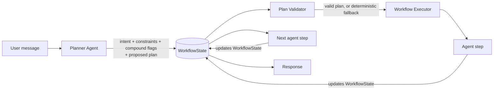
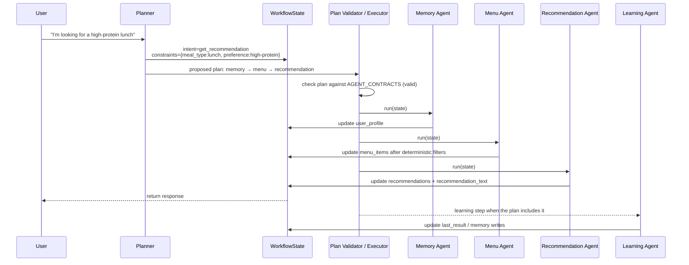
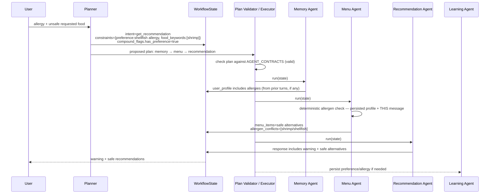
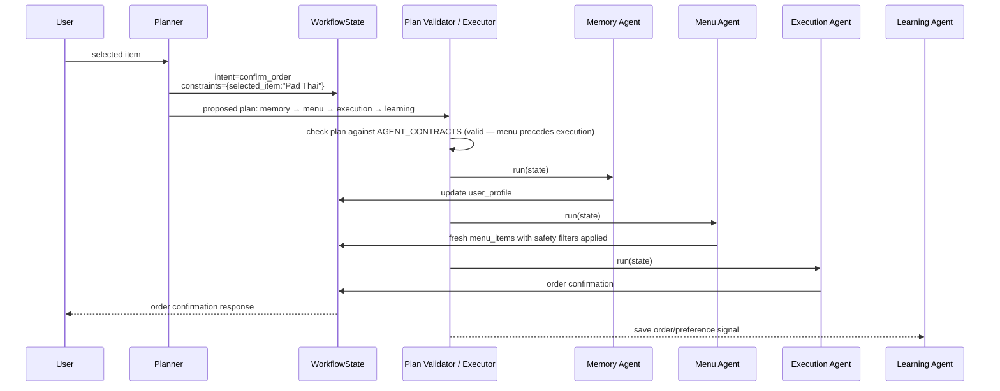
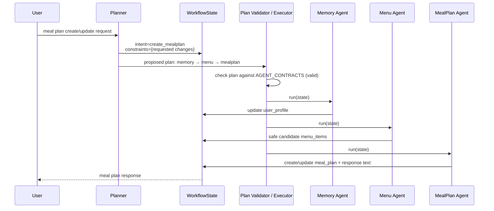
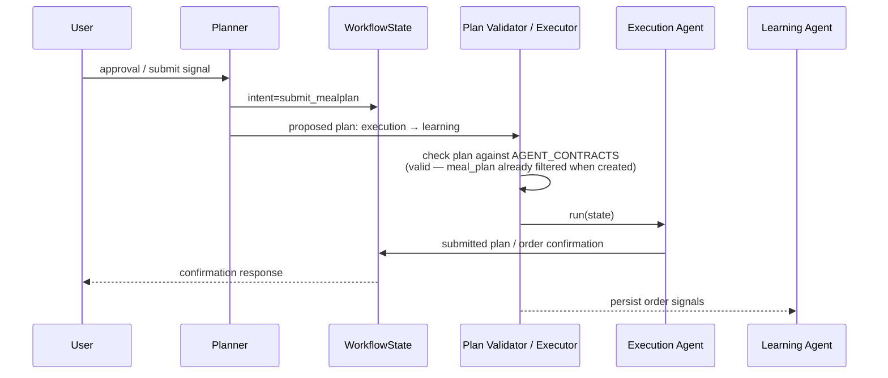
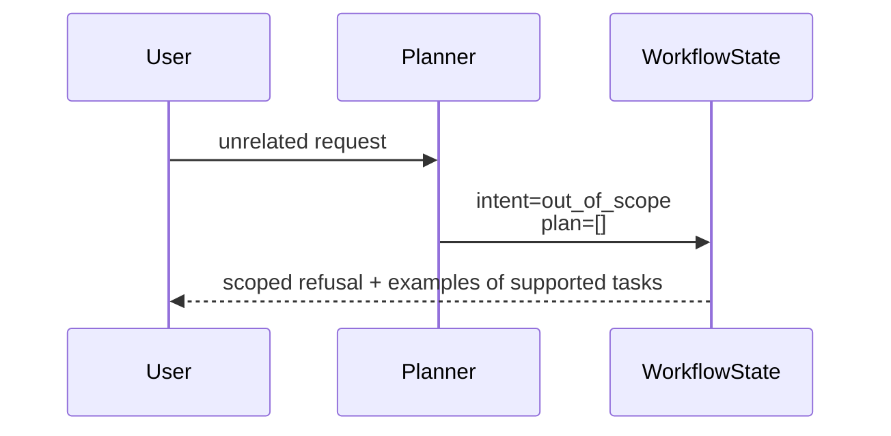
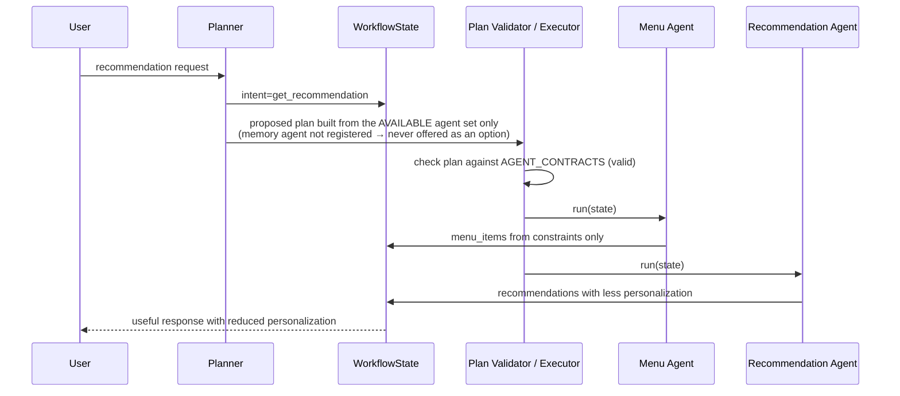
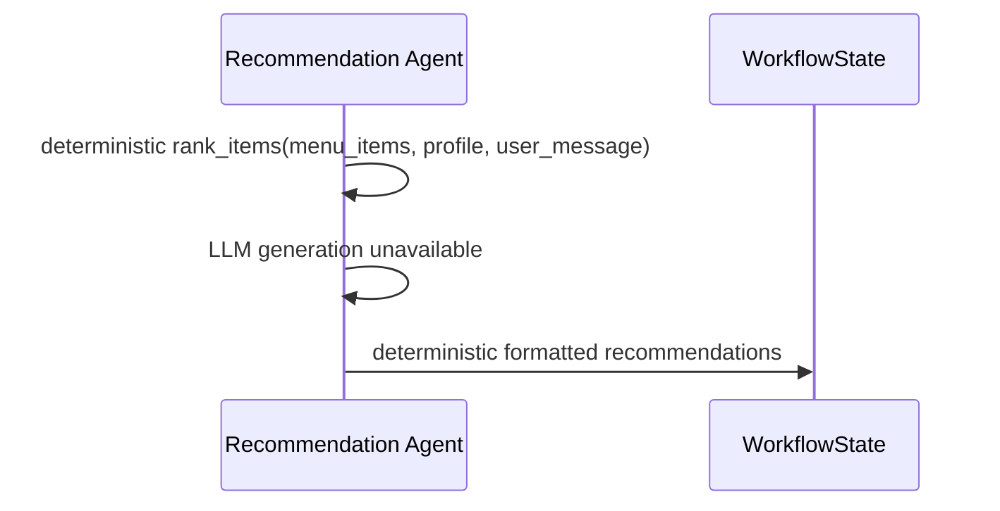
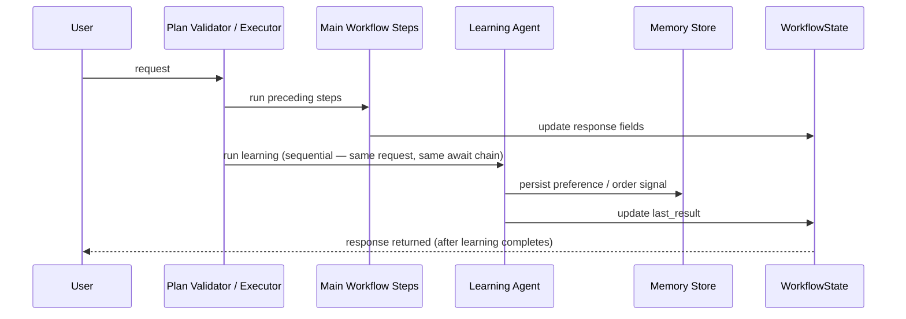

# Plateful AI — Sequence Flows

> Runtime behavior reference for interview preparation.
>
> This document explains how user requests move through the system. It complements `architecture.md`, which describes the static system structure.

---

## How to read these flows

Plateful AI does **not** use agents that call each other directly.

Instead, each request creates or updates a shared `WorkflowState`. The Planner proposes an ordered list of agent steps, a Plan Validator checks it, and the executor runs it. Each agent reads the current state, writes its outputs back into the same state object, and the next agent continues from there.



The important interview point is:

> Agents are isolated execution units. Coordination happens through shared state and deterministic workflow execution, not through direct agent-to-agent messaging.

---

## Runtime building blocks

### `WorkflowState`

The shared state object carries the request context and agent outputs across the workflow.

Key fields include:

| Field | Purpose |
|---|---|
| `trace_id` | Correlates logs, traces, and audit snapshots |
| `user_id` / `session_id` | Identifies the user and conversation session |
| `intent` | Primary classified intent |
| `constraints` | Extracted user constraints such as cuisine, budget, selected item, or food keywords |
| `user_profile` | Retrieved preferences, allergies, and user memory |
| `menu_items` | Candidate menu items after retrieval and deterministic filtering |
| `recommendations` | Ranked recommendation candidates |
| `recommendation_text` | User-facing recommendation response |
| `meal_plan` | Stateful weekly meal plan data |
| `order` | Confirmed order result |
| `allergen_conflicts` | Unsafe requested items detected during menu filtering |
| `last_result` | Last agent output for logging, tracing, and downstream use |
| `messages` | Conversation messages |

### Planner output

The Planner does not execute a workflow itself, but it does compose one — it extracts structured information *and* proposes the ordered plan:

```json
{
  "intent": "get_recommendation",
  "constraints": {
    "food_keywords": ["pasta"],
    "meal_type": "lunch"
  },
  "compound_flags": {
    "has_preference": false
  },
  "plan": [
    {"agent": "memory", "reason": "check dietary restrictions"},
    {"agent": "menu", "reason": "fetch today's safe items"},
    {"agent": "recommendation", "reason": "rank and suggest"}
  ]
}
```

The Plan Validator then checks that proposed plan against each agent's declared contract (`AGENT_CONTRACTS`) before anything executes. A plan that's missing a required input, orders a post-action agent too early, or lets `execution` proceed without a filtered menu having run is rejected and replaced with the deterministic `compose_plan` fallback for that intent — the same routing table that runs when the LLM itself is unavailable.

### Important implementation note: Policy Agent

A `PolicyAgent` exists in the codebase, but it is **not part of the active planned runtime path** described in these flows.

Safety-critical filtering currently happens inside the `MenuAgent` using deterministic allergen checks before recommendations are generated. In interview discussion, describe this as:

> The current implementation keeps allergen safety outside the LLM and applies it deterministically during menu retrieval. A Policy Agent exists as an extension point, but the active safety path is implemented in the Menu Agent.

---

# Flow 1 — Simple recommendation

## User request

> “I’m looking for a high-protein lunch.”

## Why this flow matters

This is the cleanest happy path. It shows the baseline system behavior: understand the request, retrieve relevant context, fetch safe menu items, rank them, and respond.

## Sequence



## Step-by-step

1. The Planner classifies the request as `get_recommendation`, extracts constraints, and proposes the plan `memory → menu → recommendation`.
2. The Plan Validator checks the proposal against agent contracts and executes it as-is (valid).
3. The Memory Agent enriches `WorkflowState.user_profile` with stored preferences and allergies.
4. The Menu Agent retrieves candidate items and applies deterministic filters, including allergen filtering.
5. The Recommendation Agent ranks candidates and generates the user-facing recommendation.
6. The response is returned from `WorkflowState.recommendation_text`.

## Interview takeaway

> The LLM is used for language understanding and recommendation wording, but the system remains state-driven and deterministic in how it chooses the workflow.

---

# Flow 2 — Compound preference + recommendation

## User request

> “I’m allergic to peanuts. Can you recommend something spicy?”

## Why this flow matters

This flow shows compound-request handling. The user is doing two things in one message: declaring a safety-relevant preference and asking for a recommendation.

## Sequence

```mermaid
sequenceDiagram
    participant U as User
    participant P as Planner
    participant S as WorkflowState
    participant V as Plan Validator / Executor
    participant M as Memory Agent
    participant Menu as Menu Agent
    participant Rec as Recommendation Agent
    participant L as Learning Agent

    U->>P: allergy declaration + recommendation request
    P->>S: intent=get_recommendation<br/>constraints={preference:peanut allergy, food_keywords:[spicy]}<br/>compound_flags.has_preference=true
    P->>V: proposed plan: memory → menu → recommendation → learning
    V->>V: check plan against AGENT_CONTRACTS (valid; learning correctly last)
    V->>M: run(state)
    M->>S: retrieve existing profile/allergies
    V->>Menu: run(state)
    Menu->>S: remove peanut-conflicting items deterministically
    V->>Rec: run(state)
    Rec->>S: safe ranked recommendations + response text
    S-->>U: safe recommendation response
    V-->>L: run learning step
    L->>S: persist allergy/preference to memory
```

## Step-by-step

1. The Planner identifies the primary intent as `get_recommendation`.
2. It also sets `compound_flags.has_preference = true` because the user stated an allergy, and proposes a plan that appends `learning` after the normal recommendation flow.
3. The Plan Validator confirms `learning` is correctly the last step and every other step's inputs are satisfied, then executes the plan as proposed.
4. The Menu Agent applies deterministic allergen filtering before recommendations are produced.
5. The Recommendation Agent only receives already-filtered menu candidates.
6. The Learning Agent persists the new allergy or preference after the main response path.

## Interview takeaway

> Compound intent handling lets one natural user turn trigger multiple system behaviors. The Planner is free to compose that sequence itself now — the Plan Validator is what prevents it from producing a hallucinated or unsafe execution path, not a fixed routing table.

## Discussion prompt

**If the Planner composes the plan itself, what stops it from producing something unsafe or invalid?**

The Plan Validator (`resolve_validated_plan`) checks every proposed plan against each agent's declared contract before it executes — required inputs must already be satisfied by an earlier step, post-action agents like `learning` must run last, and `execution` specifically can never proceed on a user-named item alone (it must be preceded by `menu`, or already have a filtered menu/recommendations/meal-plan available). A plan that fails any of these checks is discarded and replaced with the deterministic fallback for that intent — the LLM never gets to run an unvalidated plan, but it does get real freedom in how it composes a valid one, including compositions no static routing table was ever written for.

---

# Flow 3 — Allergy conflict during recommendation

## User request

> “I’m allergic to shellfish, but I feel like shrimp today.”

## Why this flow matters

This flow demonstrates the safety story accurately: the active implementation does not rely on a Policy Agent. It detects unsafe candidates in the Menu Agent and prevents them from reaching the Recommendation Agent.

## Sequence



## Step-by-step

1. The Planner extracts the food keyword `shrimp` and detects an allergy signal, and proposes `memory → menu → recommendation`. The Plan Validator confirms `menu` precedes `recommendation`/any eventual `execution` and executes as proposed.
2. Memory enriches the state with allergy information known from prior turns, if any exist.
3. The Menu Agent retrieves menu items, then applies deterministic allergen filtering against **both** the persisted profile and the shellfish allergy just declared in this message — a first-time "I'm allergic to shellfish, but I feel like shrimp today" is protected on this same turn, not only from the next one.
4. Unsafe shellfish items are removed from `state.menu_items`.
5. The Menu Agent records conflicts in `state.allergen_conflicts` when the user asked for something unsafe.
6. The Recommendation Agent builds a response that warns the user and suggests safe alternatives.

## Interview takeaway

> Safety-critical filtering happens before generation, and it happens twice over: the Plan Validator guarantees the Menu Agent's filtering step is present in any plan reaching `execution`, and the Menu Agent's own logic guarantees that step actually screens the current message, not just stale persisted state. The LLM can explain the result, but it does not decide — and cannot accidentally skip — whether unsafe items are allowed.

## Discussion prompt

**Where would the Policy Agent fit?**

It's already a reachable target for the Planner today — if the Planner proposes a plan that includes `policy` and the plan passes contract validation (`policy` requires `recommendations` or `menu_items`), it runs. No static fallback route includes it yet, so it's only exercised via LLM-proposed plans, which makes it a natural next step for broader business policies, approval rules, budget constraints, or dietary compliance beyond what the deterministic Menu Agent filter already covers.

---

# Flow 4 — Confirmed order

## User request

> “I’ll have the Pad Thai.”

## Why this flow matters

This flow separates recommendation from execution. The system only places an order when the user has clearly selected a specific item.

## Sequence



## Step-by-step

1. The Planner classifies the message as `confirm_order` because the user named a specific dish, and proposes `memory → menu → execution → learning`.
2. The Plan Validator checks it: `execution`'s contract explicitly does **not** accept `selected_item` alone as sufficient — naming an item is not the same as it having passed the allergen filter — so `menu` must precede it. It does here, so the plan is valid and runs as proposed. A proposal that skipped `menu` (e.g. `[execution]` alone) would be rejected and replaced with this same fallback sequence.
3. Memory retrieves the user profile.
4. Menu refreshes the available menu and applies deterministic filters.
5. Execution resolves the selected item against safe menu candidates and creates the order.
6. Learning records the order event or inferred preference.

## Interview takeaway

> The system does not execute vague ordering requests immediately. It distinguishes “I want lunch” from “I’ll have the Pad Thai,” which reduces accidental orders.

---

# Flow 5 — Meal plan creation or update

## User request

> “Create a weekly lunch plan for me.”

or, with an active meal plan:

> “Replace Tuesday’s lunch with pasta.”

## Why this flow matters

This flow demonstrates stateful behavior. The system can create or modify a weekly meal plan without treating each turn as isolated.

## Sequence



## Step-by-step

1. The Planner classifies meal-plan creation, swap, replacement, or update as `create_mealplan`, and proposes `memory → menu → mealplan`.
2. The Planner uses current `state.meal_plan` as context when available — the prompt is told whether an active plan already exists this session, which also shapes what it proposes (e.g. Flow 6 below doesn't need a fresh `menu` step at all).
3. Memory retrieves preferences and restrictions.
4. Menu retrieves safe candidate items.
5. The MealPlan Agent creates or modifies `state.meal_plan`.
6. The response reflects the new or updated plan.

## Interview takeaway

> Stateful `WorkflowState` allows the system to support follow-up requests like “replace Tuesday” without regenerating the whole plan from scratch.

---

# Flow 6 — Submit meal plan

## User request

> “Looks good, submit my plan.”

## Why this flow matters

This flow shows that planning and execution are separate. A meal plan can be drafted, revised, and only later submitted.

## Sequence



## Step-by-step

1. The Planner classifies the request as `submit_mealplan`, and proposes `execution → learning` with no fresh `menu` step.
2. The Plan Validator accepts this specifically because `state.meal_plan` is already populated this session — its contents were already filtered against `menu_items` when the MealPlan Agent built it (Flow 5), so `execution` has a legitimate, already-safe input to work from. This is the one case where skipping `menu` is correct rather than a bypass: contrast with Flow 4, where `execution` running on a bare `selected_item` with no filtered menu anywhere in scope is exactly what the validator rejects.
3. The Execution Agent reads the current meal plan from `WorkflowState`.
4. The Execution Agent submits the plan or confirms the relevant order state.
5. Learning persists the resulting order or preference signals.

## Interview takeaway

> The system supports a draft/confirm pattern instead of collapsing planning and execution into one irreversible step.

---

# Flow 7 — Out-of-scope request

## User request

> “Tell me a joke.”

## Why this flow matters

This flow demonstrates bounded system scope. Not every message should trigger retrieval, recommendation, or tool use.

## Sequence



## Step-by-step

1. The Planner classifies the message as `out_of_scope`.
2. The workflow short-circuits before any agent execution.
3. The user receives a scoped response explaining what the catering assistant can help with.

## Interview takeaway

> The system avoids unnecessary tool calls and keeps the assistant bounded to the catering domain.

---

# Flow 8 — Graceful degradation

## Scenario

One optional capability is unavailable, such as memory or LLM-powered recommendation generation.

## Why this flow matters

This flow demonstrates production-minded resilience. The system can continue operating with reduced personalization or reduced natural-language quality.

## Sequence: memory unavailable



## Sequence: recommendation LLM unavailable



## Step-by-step

1. The planner is only shown the currently available agent registry, and its proposed plan is sanitized against it — an unavailable agent can't appear in the executed plan either way, whether via LLM proposal or the deterministic fallback.
2. Steps whose agents are unavailable are never included.
3. If Claude is unavailable for recommendations, deterministic ranking and formatting still produce a useful response.
4. The system degrades in quality rather than failing the entire request.

## Interview takeaway

> Optional intelligence layers improve the experience, but the workflow is not completely dependent on every external service being available.

---

# Flow 9 — Learning as a bounded, terminal step

## Scenario

The user expresses a preference or completes an order.

## Why this flow matters

Learning improves future personalization. Its contract marks it `post_action`, so the Plan Validator guarantees it never runs before another agent that might still need to act — but be precise about what's actually implemented versus designed for, since this is a common interview follow-up.

## Sequence (what actually runs today)



## Step-by-step

1. The preceding steps in the plan produce the user-facing answer fields.
2. `learning` is included whenever the plan calls for preference or order persistence, and the Plan Validator guarantees it's ordered last.
3. The Learning Agent writes preference signals to memory.
4. **On the live LLM-planned path, this is a normal blocking step** — the response is only returned to the user after `learning` finishes. A fire-and-forget `asyncio.create_task` dispatch pattern exists in the codebase (`run_workflow`'s `step.get("async")` branch), but it's only wired into an unused legacy static flow, not the planner-driven path that's actually live.

## Interview takeaway

> Learning is architecturally isolated as a bounded, ordered-last step — that boundary is real and enforced by contract. Whether it's off the response's critical path is a separate, currently-open question: say "ordered last and testable" with confidence; don't claim "async" unless asked to also wire the dispatch into the live path, which is a small, well-scoped follow-up (the mechanism already exists, just not on this code path).

---

# Cross-flow design takeaways

Across all flows, the same implementation principles appear repeatedly:

1. **Shared-state coordination** — agents do not call each other; they read from and write to `WorkflowState`.
2. **Planner proposes the full plan, not just structure** — it extracts intent, constraints, and compound flags, *and* composes the ordered agent sequence itself; it still never directly executes tools.
3. **Contract-gated execution, not free-form trust** — the Plan Validator checks every proposed plan against declared agent contracts (`AGENT_CONTRACTS`) before it runs, and substitutes a deterministic fallback plan when it fails. The LLM has real composition freedom bounded by a hard, testable gate — not a fixed routing table deciding everything in advance.
4. **Safety before generation, twice over** — the Plan Validator guarantees a filtering step is present ahead of `execution`; the Menu Agent's own deterministic logic guarantees that step actually screens every allergen mentioned so far, including in the current message.
5. **Execution requires specificity** — the system distinguishes vague ordering intent from confirmed item selection, and its contract refuses to accept a named item alone as sufficient to place an order.
6. **Stateful follow-ups** — meal plans and conversation context can persist across turns, and the planner is told what's already available so it knows when a step is safe to skip.
7. **Graceful degradation** — optional components can fail without collapsing the full user experience; an invalid LLM plan degrades the same way an unavailable LLM does.
8. **Observability by state snapshots** — each step can be traced through inputs, outputs, and state changes, including the Plan Validator's own accept/reject decision.

---

# Interview-ready summary

A concise way to explain the runtime behavior:

> A user message is converted into structured intent, constraints, compound flags, and an ordered execution plan — the Planner builds all of it, including the agent sequence. A Plan Validator checks that proposed plan against each agent's declared contract before anything runs; an invalid plan (missing inputs, wrong ordering, or one that would let an order skip the allergen filter) is replaced with a deterministic fallback instead of executing. Each agent then receives the same `WorkflowState`, updates its own part of the state, and hands control back to the executor. Safety-critical filtering is applied deterministically during menu retrieval — against both prior known allergies and anything stated in the current message — before any recommendation text is generated. This gives the system real LLM planning freedom at the workflow-composition layer while preserving a deterministic, testable gate over what's actually allowed to execute.
